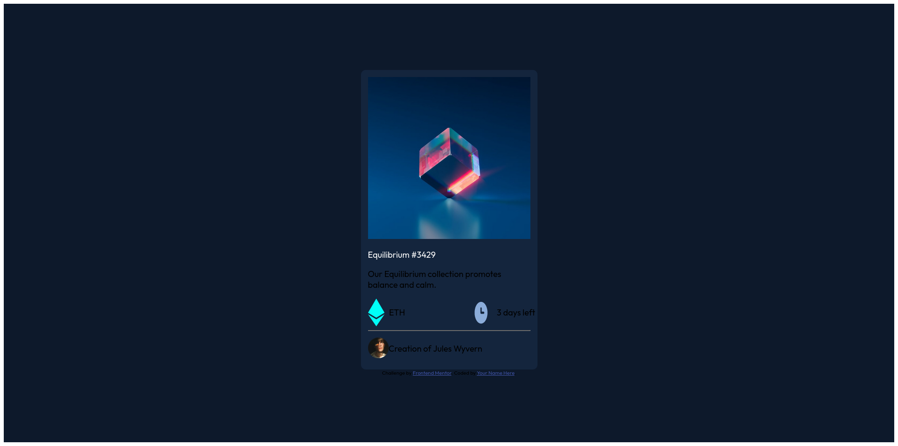

# Frontend Mentor - NFT preview card component solution

This is a solution to the [NFT preview card component challenge on Frontend Mentor](https://www.frontendmentor.io/challenges/nft-preview-card-component-SbdUL_w0U). Frontend Mentor challenges help you improve your coding skills by building realistic projects. 

## Table of contents

- [Overview](#overview)
  - [The challenge](#the-challenge)
  - [Screenshot](#screenshot)
  - [Links](#links)
- [My process](#my-process)
  - [Built with](#built-with)
  - [What I learned](#what-i-learned)

  
- [Author](#author)


## Overview
This will be very simple callenge for you if you solved the first problem qr code callenge.
This is just little advance than the qr code callenge

### The challenge

Users should be able to:

- View the optimal layout depending on their device's screen size


### Screenshot




### Links

- Solution URL: [Add solution URL here](https://github.com/darkrabel/Nft-callenge.git)
- Live Site URL: [gtihub pages](https://darkrabel.github.io/Nft-callenge/)

### Built with

- Semantic HTML5 markup
- CSS custom properties
- Flexbox
- Mobile-first 


```html
<h1>Some HTML code I'm proud of</h1>
```


## Author

- Frontend Mentor - [Faheem](https://www.frontendmentor.io/profile/darkrabel)

